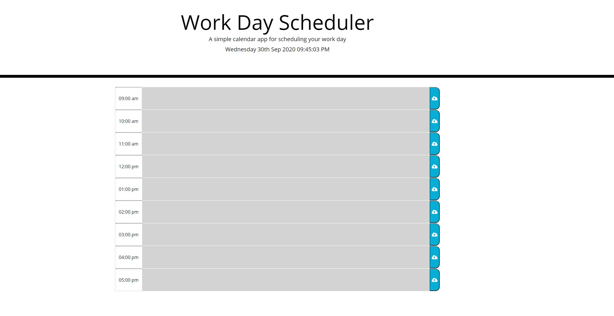

# Work-Day-Scheduler
This is a simple calendar application that allows a user to save events for each hour of the day. This app run in the browser and feature dynamically updated HTML and CSS powered by jQuery.

[View the deployed web application.](https://bryu0116.github.io/Work-Day-Scheduler/)

## Screenshot
